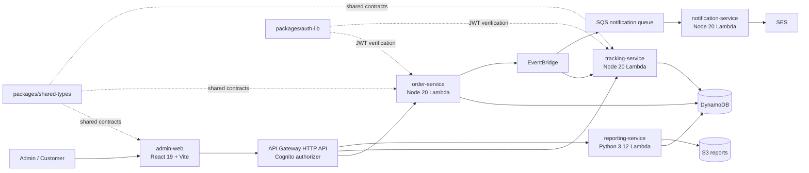

# order-platform — AGENTS.md

## Quick start

```bash
pnpm install                        # install all workspace deps
docker compose -f docker/docker-compose.yml up -d   # LocalStack + MailHog
pnpm local:deploy                   # Serverless deploy, then Terraform (order matters!)
```

## Monorepo

- **Package manager**: pnpm@10.10.0, workspaces at `apps/*` + `packages/*`
- **Task orchestration**: Turborepo (`turbo.json`). `test` depends on `build`; `typecheck` depends on `^build`
- **Filter targets**: `pnpm --filter <name> <script>` (e.g. `pnpm --filter admin-web test`)

## Developer commands

| Action | Command | Notes |
|--------|---------|-------|
| Run all tests | `pnpm --filter <pkg> test` | `vitest run` for TS, `pytest -v` for Python |
| Lint all TS | `pnpm --filter <pkg> lint` | ESLint + typescript-eslint |
| Lint Python | `uv run ruff check app/` | Run from `apps/reporting-service/` |
| Type check TS | `pnpm exec turbo run typecheck` | `tsc --noEmit` per package |
| Type check Python | `uv run mypy app/` | strict mode, pydantic plugin |
| Format | `prettier --write src` per service | No root prettier config |
| Build | `pnpm exec turbo run build` | Turborepo handles topological order |

## Testing quirks

- **Node services**: Vitest configs import from `src/**/*.test.ts` (colocated, not `tests/` dir). The top-level `tests/` dirs are empty
- **Python (reporting-service)**: pytest + moto (DynamoDB, S3, SQS mocking). `asyncio_mode = auto`. Tests mirror `app/` structure
- **admin-web**: Vitest + jsdom, setup at `src/test/setup.ts`
- **No root test command** — run per-package

## Deploy order (critical)

`scripts/local-dev.sh` does **Serverless deploy first, then Terraform apply**. Terraform targets reference Lambda functions created by Serverless. If you change infra and Lambdas, re-run both in that order.

## Application flow



## Architecture notes

- **Node Lambda services** (`order-service`, `tracking-service`, `notification-service`): CommonJS, Node 20, esbuild, serverless-localstack plugin
- **Python Lambda** (`reporting-service`): Python 3.12, uv, mypy strict, Pydantic, ruff (`E,W,F,I,UP`), pytest + moto
- **Frontend** (`admin-web`): React 19 + Vite + React Query + jsdom/vitest, React Router v7
- **API**: API Gateway HTTP API via Serverless, Cognito auth, shared types from `packages/shared-types`
- **Events**: SQS + EventBridge, JSON Schema contracts in `packages/event-schema/`
- **Auth lib** (`packages/auth-lib`): `aws-jwt-verify`, built to `dist/`

## LocalStack

- `.env.local` has LocalStack defaults (auto-loaded when services read env)
- Cognito only works with LocalStack **Pro**; free tier skips auth locally
- MailHog at `http://localhost:8025` captures SES emails
- Services run as local Serverless deployments pointing at LocalStack

## CI/CD

- `platform.yml` is the main pipeline: DEV → STAGING → PROD (manual approval gate)
- Reusable workflows: `backend.yml`, `deploy-reporting-service.yml`, `deploy-frontend.yml`, `terraform-common.yml`
- `test.yml` and `deploy-tracking-service.yml` are empty placeholders

## Conventions

- Prettier + ESLint in every TS package, no root config
- `@typescript-eslint/no-unused-vars` errors with `argsIgnorePattern: '^_'`
- Empty `tests/` dir in Node services misleads — actual tests are in `src/**/*.test.ts`
- Turbo cache outputs in `dist/**` — clean with `turbo clean` or manually `rm -rf packages/*/dist apps/*/dist`
