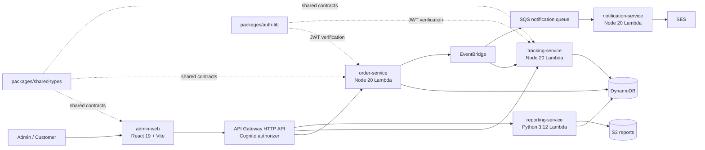

# Order Platform

Cloud-native, event-driven, serverless order management platform. Built with polyglot microservices (Node.js + Python) on AWS.

## Architecture



## Stack

| Layer               | Technology                              |
| ------------------- | --------------------------------------- |
| **Admin Frontend**  | React + Vite + React Query + TypeScript |
| **Public Frontend** | React + Vite + TypeScript               |
| **API Gateway**     | Amazon API Gateway + Cognito            |
| **Sync Services**   | Node.js + TypeScript (AWS Lambda)       |
| **Async Services**  | Python 3.12 (AWS Lambda)                |
| **Messaging**       | Amazon SQS + EventBridge                |
| **Database**        | Amazon DynamoDB                         |
| **Storage**         | Amazon S3                               |
| **Auth**            | Amazon Cognito                          |
| **Infrastructure**  | Terraform + Serverless Framework        |
| **Monorepo**        | pnpm workspaces + Turbo                 |
| **CI/CD**           | GitHub Actions                          |

## Repository Structure

```
order-platform/
├── apps/
│   ├── order-service/            # Core business — create/query orders
│   ├── tracking-service/         # Order status timeline
│   ├── notification-service/     # Email/SMS notifications
│   ├── reporting-service/        # Async analytics processing
│   ├── api-gateway/              # API Gateway configuration
│   ├── admin-web/                # Internal admin panel
│   └── public-web/               # Public customer portal
├── packages/
│   ├── event-schema/             # JSON Schema contracts between services
│   ├── shared-types/             # Shared TypeScript interfaces
│   ├── shared-utils/             # Reusable helpers
│   └── auth-lib/                 # Cognito/JWT helpers
├── infra/
│   ├── main.tf                   # AWS Provider
│   ├── modules/                  # Reusable Terraform modules
│   │   ├── cognito/              # User pools, clients, groups
│   │   ├── dynamodb/             # DynamoDB tables
│   │   ├── sqs/                  # Queues + DLQ
│   │   ├── s3/                   # Buckets
│   │   ├── api-gateway/          # API Gateway + authorizers
│   │   ├── lambda/               # Lambda functions
│   │   ├── sns/                  # SNS topics
│   │   └── iam/                  # Policies and roles
│   └── environments/
│       ├── dev/                  # Development (LocalStack or real AWS)
│       ├── staging/              # Pre-production
│       └── prod/                 # Production
├── docs/                         # Project documentation
├── scripts/                      # Utility scripts
├── docker/                       # Docker Compose (LocalStack, etc.)
└── .github/workflows/            # GitHub Actions pipelines
```

## Services

### 🔵 Sync (Node.js + TypeScript)

| Service              | Endpoints                          | Description                                           |
| -------------------- | ---------------------------------- | ----------------------------------------------------- |
| **order-service**    | `POST /orders`, `GET /orders/{id}` | Core business — create and query orders, emits events |
| **tracking-service** | `GET /tracking/{orderId}`          | Status timeline per order                             |

### 🟢 Async (Python / Node.js)

| Service                  | Runtime     | Description                                                |
| ------------------------ | ----------- | ---------------------------------------------------------- |
| **reporting-service**    | Python 3.12 | Consumes events, persists to DynamoDB and S3 for analytics |
| **notification-service** | Node.js     | Sends emails/SMS on order status changes                   |

### 🟣 Frontend (React + TypeScript)

| App            | Stack                      | Users             |
| -------------- | -------------------------- | ----------------- |
| **admin-web**  | React + Vite + React Query | Admins, operators |
| **public-web** | React + Vite               | Customers         |

## Shared Packages

| Package        | Description                                              |
| -------------- | -------------------------------------------------------- |
| `event-schema` | JSON Schema contracts (`order.created`, `order.updated`) |
| `shared-types` | Shared TypeScript interfaces (Order, User, Tracking)     |
| `shared-utils` | Helpers: validation, formatting, constants               |
| `auth-lib`     | Cognito helpers: verify token, authorize by group        |

## AWS Infrastructure

| Resource        | Purpose                                                |
| --------------- | ------------------------------------------------------ |
| **Cognito**     | Centralized auth with groups (admin, operator, viewer) |
| **API Gateway** | HTTP entry point with rate limiting and authorizer     |
| **Lambda**      | Serverless compute for all services                    |
| **DynamoDB**    | Operational database (orders, tracking, events)        |
| **SQS**         | Async communication between services                   |
| **S3**          | Analytics storage (reporting) and frontend hosting     |
| **SNS/SES**     | Notifications                                          |

## Design Philosophy

- **Sync services (Node)**: fast, APIs, core business logic
- **Async services (Python/Node)**: events, processing, independent scaling
- **Event-driven**: services communicate through events, not direct calls
- **Polyglot**: each service uses the best language for its domain
- **Serverless-first**: zero servers, auto-scaling, pay-per-use

## Local Development

```bash
# Install dependencies
pnpm install

# Start LocalStack (local AWS infra)
docker compose -f docker/docker-compose.yml up -d

# Deploy infra to LocalStack
pnpm run tf:init:dev
pnpm run tf:apply:dev

# Develop individual services
cd packages/shared-types && pnpm run build
cd apps/order-service && pnpm run dev

# Or with Turbo (all services)
turbo run dev
```

### Prerequisites

- Node.js >= 20
- pnpm >= 10
- Python 3.12
- uv (Python package manager)
- Docker + LocalStack
- Terraform >= 1.5
- Serverless Framework 4
- AWS CLI configured

## CI/CD

The pipeline auto-deploys across 3 environments on push to `main`:

```
main ──▶ DEV ──▶ STAGING ──▶ PROD (manual approval)
         │         │             │
         ├─ infra  ├─ infra      ├─ infra
         ├─ backend├─ backend    ├─ backend
         ├─ frontend             ├─ frontend
         └─ reporting            └─ reporting
```

Each stage runs:

1. Terraform apply (infrastructure)
2. Serverless deploy (backend services)
3. S3 sync + CloudFront (frontends)

## Project Tracking

Progress is tracked via [GitHub Issues](https://github.com/aogallo/order-platform/issues) organized by phases:

| Phase | Description                                              | Issues                                                                                                                                                                                                                                                                                                                                                                                                                                                                                  |
| ----- | -------------------------------------------------------- | --------------------------------------------------------------------------------------------------------------------------------------------------------------------------------------------------------------------------------------------------------------------------------------------------------------------------------------------------------------------------------------------------------------------------------------------------------------------------------------- |
| **1** | Shared Packages (shared-types, shared-utils, auth-lib)   | [#18](https://github.com/aogallo/order-platform/issues/18) [#19](https://github.com/aogallo/order-platform/issues/19) [#20](https://github.com/aogallo/order-platform/issues/20)                                                                                                                                                                                                                                                                                                        |
| **2** | tracking-service (scaffold, handler, event consumer)     | [#21](https://github.com/aogallo/order-platform/issues/21) [#22](https://github.com/aogallo/order-platform/issues/22) [#23](https://github.com/aogallo/order-platform/issues/23)                                                                                                                                                                                                                                                                                                        |
| **3** | notification-service (scaffold, consumer, SES adapter)   | [#24](https://github.com/aogallo/order-platform/issues/24) [#25](https://github.com/aogallo/order-platform/issues/25) [#26](https://github.com/aogallo/order-platform/issues/26)                                                                                                                                                                                                                                                                                                        |
| **4** | API Gateway (Terraform module + Cognito authorizer)      | [#27](https://github.com/aogallo/order-platform/issues/27)                                                                                                                                                                                                                                                                                                                                                                                                                              |
| **5** | admin-web (scaffold, auth, orders, dashboard, users)     | [#28](https://github.com/aogallo/order-platform/issues/28) [#29](https://github.com/aogallo/order-platform/issues/29) [#30](https://github.com/aogallo/order-platform/issues/30) [#31](https://github.com/aogallo/order-platform/issues/31) [#32](https://github.com/aogallo/order-platform/issues/32)                                                                                                                                                                                  |
| **6** | public-web (scaffold, auth, order creation, tracking)    | [#33](https://github.com/aogallo/order-platform/issues/33) [#34](https://github.com/aogallo/order-platform/issues/34) [#35](https://github.com/aogallo/order-platform/issues/35) [#36](https://github.com/aogallo/order-platform/issues/36)                                                                                                                                                                                                                                             |
| **7** | Infra + CI/CD (staging, prod, modules, pipelines, tests) | [#37](https://github.com/aogallo/order-platform/issues/37) [#38](https://github.com/aogallo/order-platform/issues/38) [#39](https://github.com/aogallo/order-platform/issues/39) [#40](https://github.com/aogallo/order-platform/issues/40) [#41](https://github.com/aogallo/order-platform/issues/41) [#42](https://github.com/aogallo/order-platform/issues/42) [#43](https://github.com/aogallo/order-platform/issues/43) [#44](https://github.com/aogallo/order-platform/issues/44) |

### Existing Issues (previous)

| Issue                                                      | Description                              | Status    |
| ---------------------------------------------------------- | ---------------------------------------- | --------- |
| [#2](https://github.com/aogallo/order-platform/issues/2)   | reporting-service: event-driven pipeline | 🔄 Open   |
| [#3](https://github.com/aogallo/order-platform/issues/3)   | event-schema: JSON Schema contracts      | ✅ Closed |
| [#4](https://github.com/aogallo/order-platform/issues/4)   | reporting-service: Python tooling        | ✅ Closed |
| [#5](https://github.com/aogallo/order-platform/issues/5)   | reporting-service: domain layer          | ✅ Closed |
| [#6](https://github.com/aogallo/order-platform/issues/6)   | infra: SQS, DynamoDB, S3, IAM            | ✅ Closed |
| [#7](https://github.com/aogallo/order-platform/issues/7)   | reporting-service: adapters              | ✅ Closed |
| [#8](https://github.com/aogallo/order-platform/issues/8)   | reporting-service: use case              | ✅ Closed |
| [#9](https://github.com/aogallo/order-platform/issues/9)   | reporting-service: Lambda handler        | 🔄 Open   |
| [#10](https://github.com/aogallo/order-platform/issues/10) | order-service: publish to SQS            | 🔄 Open   |
| [#11](https://github.com/aogallo/order-platform/issues/11) | reporting-service: Serverless config     | 🔄 Open   |
| [#12](https://github.com/aogallo/order-platform/issues/12) | reporting-service: cleanup + README      | 🔄 Open   |

## License

MIT
